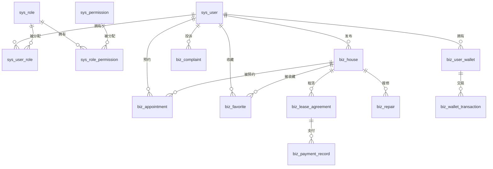

# 房屋租赁平台 - 数据库表结构文档

## 概述

本文档基于实际数据库查询结果，描述了房屋租赁平台的数据库表结构。数据库类型为 MySQL，数据库名称：`house_eco`。

---

## 一、系统表

### 1.1 用户表 (`sys_user`)

| 字段名 | 类型 | 可空 | 键 | 默认值 | 说明 |
| :--- | :--- | :--- | :--- | :--- | :--- |
| `id` | bigint | NO | PRI | NULL | 主键ID，自增 |
| `username` | varchar(50) | NO | UNI | NULL | 用户名 |
| `password` | varchar(100) | NO | - | NULL | 密码（加密存储） |
| `nickname` | varchar(50) | YES | - | NULL | 昵称 |
| `real_name` | varchar(50) | YES | - | NULL | 真实姓名 |
| `id_card` | varchar(18) | YES | - | NULL | 身份证号 |
| `phone` | varchar(20) | YES | - | NULL | 手机号 |
| `email` | varchar(100) | YES | - | NULL | 邮箱 |
| `avatar` | varchar(255) | YES | - | NULL | 头像URL |
| `gender` | tinyint(1) | YES | - | 0 | 性别（0-未知，1-男，2-女） |
| `user_type` | varchar(20) | YES | - | NULL | 用户类型（LANDLORD/TENANT/AGENT/ADMIN） |
| `credit_score` | int | YES | - | 100 | 信用分 |
| `status` | tinyint(1) | YES | - | 1 | 状态（0-禁用，1-启用，2-锁定） |
| `last_login_time` | datetime | YES | - | NULL | 最后登录时间 |
| `last_login_ip` | varchar(50) | YES | - | NULL | 最后登录IP |
| `login_fail_count` | int | YES | - | 0 | 登录失败次数 |
| `password_update_time` | datetime | YES | - | NULL | 密码最后修改时间 |
| `is_deleted` | tinyint(1) | YES | - | 0 | 删除标志（0-未删除，1-已删除） |
| `create_time` | datetime | YES | - | CURRENT_TIMESTAMP | 创建时间 |
| `update_time` | datetime | YES | - | CURRENT_TIMESTAMP | 更新时间 |
| `create_by` | bigint | YES | - | NULL | 创建人ID |
| `update_by` | bigint | YES | - | NULL | 更新人ID |
| `version` | int | YES | - | 0 | 乐观锁版本号 |
| `remark` | varchar(500) | YES | - | NULL | 备注 |

### 1.2 角色表 (`sys_role`)

| 字段名 | 类型 | 可空 | 键 | 默认值 | 说明 |
| :--- | :--- | :--- | :--- | :--- | :--- |
| `id` | bigint | NO | PRI | NULL | 主键ID，自增 |
| `role_code` | varchar(50) | NO | UNI | NULL | 角色编码 |
| `role_name` | varchar(50) | NO | - | NULL | 角色名称 |
| `description` | varchar(200) | YES | - | NULL | 角色描述 |
| `is_deleted` | tinyint(1) | YES | - | 0 | 删除标志 |
| `create_time` | datetime | YES | - | CURRENT_TIMESTAMP | 创建时间 |

### 1.3 权限表 (`sys_permission`)

| 字段名 | 类型 | 可空 | 键 | 默认值 | 说明 |
| :--- | :--- | :--- | :--- | :--- | :--- |
| `id` | bigint | NO | PRI | NULL | 主键ID，自增 |
| `perm_code` | varchar(50) | NO | UNI | NULL | 权限编码 |
| `perm_name` | varchar(50) | NO | - | NULL | 权限名称 |
| `path` | varchar(255) | YES | - | NULL | 权限路径/URL |
| `method` | varchar(10) | YES | - | NULL | 请求方法（GET/POST/PUT/DELETE） |
| `is_deleted` | tinyint(1) | YES | - | 0 | 删除标志 |
| `create_time` | datetime | YES | - | CURRENT_TIMESTAMP | 创建时间 |

### 1.4 用户角色关联表 (`sys_user_role`)

| 字段名 | 类型 | 可空 | 键 | 默认值 | 说明 |
| :--- | :--- | :--- | :--- | :--- | :--- |
| `id` | bigint | NO | PRI | NULL | 主键ID，自增 |
| `user_id` | bigint | NO | MUL | NULL | 用户ID |
| `role_id` | bigint | NO | MUL | NULL | 角色ID |
| `is_deleted` | tinyint(1) | YES | - | 0 | 删除标志 |
| `create_time` | datetime | YES | - | CURRENT_TIMESTAMP | 创建时间 |

### 1.5 角色权限关联表 (`sys_role_permission`)

| 字段名 | 类型 | 可空 | 键 | 默认值 | 说明 |
| :--- | :--- | :--- | :--- | :--- | :--- |
| `id` | bigint | NO | PRI | NULL | 主键ID，自增 |
| `role_id` | bigint | NO | MUL | NULL | 角色ID |
| `perm_id` | bigint | NO | MUL | NULL | 权限ID |
| `is_deleted` | tinyint(1) | YES | - | 0 | 删除标志 |
| `create_time` | datetime | YES | - | CURRENT_TIMESTAMP | 创建时间 |

---

## 二、业务表

### 2.1 房源表 (`biz_house`)

| 字段名 | 类型 | 可空 | 键 | 默认值 | 说明 |
| :--- | :--- | :--- | :--- | :--- | :--- |
| `id` | bigint | NO | PRI | NULL | 主键ID，自增 |
| `landlord_id` | bigint | NO | MUL | NULL | 房东ID |
| `house_no` | varchar(32) | NO | UNI | NULL | 房源编号 |
| `title` | varchar(200) | NO | - | NULL | 房源标题 |
| `description` | text | YES | - | NULL | 房源描述 |
| `province` | varchar(50) | YES | - | NULL | 省份 |
| `city` | varchar(50) | YES | - | NULL | 城市 |
| `district` | varchar(50) | YES | - | NULL | 区县 |
| `street` | varchar(100) | YES | - | NULL | 街道 |
| `address` | varchar(255) | NO | - | NULL | 详细地址 |
| `longitude` | decimal(12,8) | YES | - | NULL | 经度 |
| `latitude` | decimal(12,8) | YES | - | NULL | 纬度 |
| `house_type` | varchar(50) | YES | - | NULL | 户型（如：2室1厅1卫） |
| `room_count` | int | YES | - | NULL | 房间数 |
| `hall_count` | int | YES | - | NULL | 客厅数 |
| `bathroom_count` | int | YES | - | NULL | 卫生间数 |
| `area` | decimal(10,2) | YES | - | NULL | 面积（平方米） |
| `floor` | int | YES | - | NULL | 楼层 |
| `total_floor` | int | YES | - | NULL | 总楼层 |
| `has_elevator` | tinyint(1) | YES | - | 0 | 电梯（0-无，1-有） |
| `decoration` | tinyint(1) | YES | - | NULL | 装修情况（1-毛坯，2-简装，3-精装，4-豪装） |
| `orientation` | tinyint(1) | YES | - | NULL | 朝向（1-东，2-南，3-西，4-北等） |
| `rent_price` | decimal(15,2) | NO | - | NULL | 租金（元/月） |
| `deposit_month` | int | YES | - | 1 | 押金（月） |
| `payment_way` | tinyint(1) | YES | - | 2 | 付款方式（1-押一付一，2-押一付三等） |
| `rent_way` | tinyint(1) | YES | - | 1 | 租赁方式（1-整租，2-合租） |
| `min_lease_term` | int | YES | - | 12 | 最小租期（月） |
| `facilities` | varchar(500) | YES | - | NULL | 配套设施（JSON格式） |
| `images` | text | YES | - | NULL | 房源图片（JSON格式） |
| `cover_image` | varchar(255) | YES | - | NULL | 封面图片 |
| `contact_name` | varchar(50) | YES | - | NULL | 联系人姓名 |
| `contact_phone` | varchar(20) | YES | - | NULL | 联系人电话 |
| `view_time_type` | tinyint(1) | YES | - | NULL | 看房时间类型 |
| `available_date` | datetime | YES | - | NULL | 可入住时间 |
| `status` | tinyint(1) | YES | - | 0 | 房源状态（0-展示中，1-已租，2-已下架） |
| `audit_status` | tinyint(1) | YES | - | 0 | 审核状态（0-待审核，1-审核通过，2-审核拒绝） |
| `audit_remark` | varchar(500) | YES | - | NULL | 审核意见 |
| `auditor_id` | bigint | YES | - | NULL | 审核人ID |
| `audit_time` | datetime | YES | - | NULL | 审核时间 |
| `view_count` | int | YES | - | 0 | 浏览次数 |
| `favorite_count` | int | YES | - | 0 | 收藏次数 |
| `appointment_count` | int | YES | - | 0 | 预约次数 |
| `is_deleted` | tinyint(1) | YES | - | 0 | 删除标志 |
| `remark` | varchar(500) | YES | - | NULL | 备注 |
| `create_time` | datetime | YES | - | CURRENT_TIMESTAMP | 创建时间 |
| `update_time` | datetime | YES | - | CURRENT_TIMESTAMP | 更新时间 |
| `create_by` | bigint | YES | - | NULL | 创建人ID |
| `update_by` | bigint | YES | - | NULL | 更新人ID |
| `version` | int | YES | - | 0 | 乐观锁版本号 |

### 2.2 预约看房表 (`biz_appointment`)

| 字段名 | 类型 | 可空 | 键 | 默认值 | 说明 |
| :--- | :--- | :--- | :--- | :--- | :--- |
| `id` | bigint | NO | PRI | NULL | 主键ID，自增 |
| `appointment_no` | varchar(32) | NO | UNI | NULL | 预约编号 |
| `house_id` | bigint | NO | MUL | NULL | 房源ID |
| `tenant_id` | bigint | NO | MUL | NULL | 租客ID |
| `landlord_id` | bigint | NO | MUL | NULL | 房东ID |
| `appointment_time` | datetime | NO | - | NULL | 预约时间 |
| `status` | tinyint(1) | YES | - | 0 | 状态（0-待确认，1-已确认，2-已完成，3-已取消，4-已拒绝） |
| `contact_name` | varchar(50) | YES | - | NULL | 联系人姓名 |
| `contact_phone` | varchar(20) | YES | - | NULL | 联系人电话 |
| `remark` | varchar(255) | YES | - | NULL | 备注 |
| `is_deleted` | tinyint(1) | YES | - | 0 | 删除标志 |
| `create_time` | datetime | YES | - | CURRENT_TIMESTAMP | 创建时间 |
| `update_time` | datetime | YES | - | CURRENT_TIMESTAMP | 更新时间 |
| `create_by` | bigint | YES | - | NULL | 创建人ID |
| `update_by` | bigint | YES | - | NULL | 更新人ID |
| `version` | int | YES | - | 0 | 乐观锁版本号 |

### 2.3 租约表 (`biz_lease_agreement`)

| 字段名 | 类型 | 可空 | 键 | 默认值 | 说明 |
| :--- | :--- | :--- | :--- | :--- | :--- |
| `id` | bigint | NO | PRI | NULL | 主键ID，自增 |
| `agreement_no` | varchar(50) | NO | UNI | NULL | 租约编号 |
| `house_id` | bigint | NO | MUL | NULL | 房源ID |
| `tenant_id` | bigint | NO | MUL | NULL | 租客ID |
| `landlord_id` | bigint | NO | MUL | NULL | 房东ID |
| `start_date` | date | NO | - | NULL | 起租日期 |
| `end_date` | date | NO | - | NULL | 到期日期 |
| `monthly_rent` | decimal(15,2) | NO | - | NULL | 月租金（元） |
| `deposit` | decimal(15,2) | NO | - | NULL | 押金（元） |
| `status` | tinyint(1) | YES | - | 0 | 状态（0-待签署，1-已签署，2-已生效，3-已到期等） |
| `contract_url` | varchar(255) | YES | - | NULL | 合同文件URL |
| `is_deleted` | tinyint(1) | YES | - | 0 | 删除标志 |
| `create_time` | datetime | YES | - | CURRENT_TIMESTAMP | 创建时间 |
| `update_time` | datetime | YES | - | CURRENT_TIMESTAMP | 更新时间 |

### 2.4 支付记录表 (`biz_payment_record`)

| 字段名 | 类型 | 可空 | 键 | 默认值 | 说明 |
| :--- | :--- | :--- | :--- | :--- | :--- |
| `id` | bigint | NO | PRI | NULL | 主键ID，自增 |
| `order_no` | varchar(50) | NO | UNI | NULL | 支付编号 |
| `user_id` | bigint | NO | MUL | NULL | 用户ID |
| `amount` | decimal(15,2) | NO | - | NULL | 支付金额 |
| `pay_type` | tinyint(1) | YES | - | NULL | 支付类型（1-租金，2-押金，3-违约金） |
| `status` | tinyint(1) | YES | - | 0 | 支付状态（0-待支付，1-支付成功等） |
| `third_party_no` | varchar(100) | YES | - | NULL | 第三方支付平台订单号 |
| `is_deleted` | tinyint(1) | YES | - | 0 | 删除标志 |
| `create_time` | datetime | YES | - | CURRENT_TIMESTAMP | 创建时间 |
| `update_time` | datetime | YES | - | CURRENT_TIMESTAMP | 更新时间 |
| `tenant_id` | bigint | NO | - | 0 | 租客ID |

### 2.5 收藏表 (`biz_favorite`)

| 字段名 | 类型 | 可空 | 键 | 默认值 | 说明 |
| :--- | :--- | :--- | :--- | :--- | :--- |
| `id` | bigint | NO | PRI | NULL | 主键ID，自增 |
| `user_id` | bigint | NO | MUL | NULL | 用户ID |
| `house_id` | bigint | NO | MUL | NULL | 房源ID |
| `is_deleted` | tinyint(1) | YES | - | 0 | 删除标志 |
| `create_time` | datetime | YES | - | CURRENT_TIMESTAMP | 创建时间 |

### 2.6 投诉表 (`biz_complaint`)

| 字段名 | 类型 | 可空 | 键 | 默认值 | 说明 |
| :--- | :--- | :--- | :--- | :--- | :--- |
| `id` | bigint | NO | PRI | NULL | 主键ID，自增 |
| `from_user_id` | bigint | NO | MUL | NULL | 投诉人ID |
| `target_id` | bigint | YES | - | NULL | 被投诉人ID |
| `type` | tinyint(1) | YES | - | NULL | 投诉类型（1-房源问题，2-服务问题等） |
| `content` | varchar(500) | NO | - | NULL | 投诉内容 |
| `images` | text | YES | - | NULL | 投诉证据（JSON格式） |
| `status` | tinyint(1) | YES | - | 0 | 处理状态（0-待处理，1-处理中，2-已处理，3-已驳回） |
| `handle_result` | varchar(500) | YES | - | NULL | 处理结果 |
| `is_deleted` | tinyint(1) | YES | - | 0 | 删除标志 |
| `create_time` | datetime | YES | - | CURRENT_TIMESTAMP | 创建时间 |
| `update_time` | datetime | YES | - | CURRENT_TIMESTAMP | 更新时间 |

### 2.7 报修表 (`biz_repair`)

| 字段名 | 类型 | 可空 | 键 | 默认值 | 说明 |
| :--- | :--- | :--- | :--- | :--- | :--- |
| `id` | bigint | NO | PRI | NULL | 主键ID，自增 |
| `house_id` | bigint | NO | - | NULL | 房源ID |
| `tenant_id` | bigint | NO | - | NULL | 租客ID |
| `landlord_id` | bigint | NO | - | NULL | 房东ID |
| `repair_type` | varchar(50) | YES | - | NULL | 报修类型 |
| `description` | text | YES | - | NULL | 报修描述 |
| `status` | tinyint(1) | YES | - | 0 | 状态 |
| `evaluate_content` | text | YES | - | NULL | 评价内容 |
| `evaluate_score` | int | YES | - | NULL | 评价分数 |
| `is_deleted` | tinyint(1) | YES | - | 0 | 删除标志 |
| `create_time` | datetime | YES | - | CURRENT_TIMESTAMP | 创建时间 |
| `update_time` | datetime | YES | - | CURRENT_TIMESTAMP | 更新时间 |
| `create_by` | bigint | YES | - | NULL | 创建人ID |
| `update_by` | bigint | YES | - | NULL | 更新人ID |
| `version` | int | YES | - | 0 | 乐观锁版本号 |

### 2.8 用户钱包表 (`biz_user_wallet`)

| 字段名 | 类型 | 可空 | 键 | 默认值 | 说明 |
| :--- | :--- | :--- | :--- | :--- | :--- |
| `user_id` | bigint | NO | PRI | NULL | 用户ID（主键） |
| `balance` | decimal(18,2) | YES | - | 0.00 | 余额 |
| `freeze_balance` | decimal(18,2) | YES | - | 0.00 | 冻结金额 |
| `version` | int | YES | - | 0 | 乐观锁版本号 |
| `is_deleted` | tinyint(1) | YES | - | 0 | 删除标志 |
| `create_time` | datetime | YES | - | CURRENT_TIMESTAMP | 创建时间 |
| `update_time` | datetime | YES | - | CURRENT_TIMESTAMP | 更新时间 |

---

## 三、其他表

### 3.1 登录日志表 (`sys_login_log`)

| 字段名 | 类型 | 说明 |
| :--- | :--- | :--- |
| `id` | bigint | 主键ID |
| `user_id` | bigint | 用户ID |
| `login_time` | datetime | 登录时间 |
| `login_ip` | varchar(50) | 登录IP |
| `login_type` | varchar(20) | 登录类型 |
| `status` | tinyint(1) | 登录状态 |
| `error_message` | varchar(255) | 错误信息 |
| `is_deleted` | tinyint(1) | 删除标志 |
| `create_time` | datetime | 创建时间 |

### 3.2 审计日志表 (`biz_audit_log`)

| 字段名 | 类型 | 说明 |
| :--- | :--- | :--- |
| `id` | bigint | 主键ID |
| `user_id` | bigint | 用户ID |
| `username` | varchar(50) | 用户名 |
| `module` | varchar(50) | 操作模块 |
| `operation` | varchar(50) | 操作类型 |
| `target_type` | varchar(50) | 目标类型 |
| `target_id` | bigint | 目标ID |
| `content` | text | 操作内容 |
| `ip` | varchar(50) | 操作IP |
| `is_deleted` | tinyint(1) | 删除标志 |
| `create_time` | datetime | 创建时间 |

### 3.3 钱包交易日志表 (`biz_wallet_transaction`)

| 字段名 | 类型 | 说明 |
| :--- | :--- | :--- |
| `id` | bigint | 主键ID |
| `user_id` | bigint | 用户ID |
| `transaction_type` | varchar(20) | 交易类型 |
| `amount` | decimal(18,2) | 交易金额 |
| `before_balance` | decimal(18,2) | 交易前余额 |
| `after_balance` | decimal(18,2) | 交易后余额 |
| `remark` | varchar(255) | 备注 |
| `is_deleted` | tinyint(1) | 删除标志 |
| `create_time` | datetime | 创建时间 |

---

## 四、表关系图

---

## 五、状态码说明

### 5.1 用户状态 (`sys_user.status`)

| 状态码 | 说明 |
| :--- | :--- |
| 0 | 禁用 |
| 1 | 启用 |
| 2 | 锁定 |

### 5.2 房源状态 (`biz_house.status`)

| 状态码 | 说明 |
| :--- | :--- |
| 0 | 展示中 |
| 1 | 已租 |
| 2 | 已下架 |

### 5.3 房源审核状态 (`biz_house.audit_status`)

| 状态码 | 说明 |
| :--- | :--- |
| 0 | 待审核 |
| 1 | 审核通过 |
| 2 | 审核拒绝 |

### 5.4 预约状态 (`biz_appointment.status`)

| 状态码 | 说明 |
| :--- | :--- |
| 0 | 待确认 |
| 1 | 已确认 |
| 2 | 已完成 |
| 3 | 已取消 |
| 4 | 已拒绝 |

### 5.5 租约状态 (`biz_lease_agreement.status`)

| 状态码 | 说明 |
| :--- | :--- |
| 0 | 待签署 |
| 1 | 已签署 |
| 2 | 已生效 |
| 3 | 已到期 |
| 4 | 已解约 |
| 5 | 已终止 |

### 5.6 支付状态 (`biz_payment_record.status`)

| 状态码 | 说明 |
| :--- | :--- |
| 0 | 待支付 |
| 1 | 支付成功 |
| 2 | 支付失败 |
| 3 | 退款中 |
| 4 | 已退款 |

### 5.7 投诉状态 (`biz_complaint.status`)

| 状态码 | 说明 |
| :--- | :--- |
| 0 | 待处理 |
| 1 | 处理中 |
| 2 | 已处理 |
| 3 | 已驳回 |

---

## 六、数据库表清单

| 序号 | 表名 | 说明 |
| :--- | :--- | :--- |
| 1 | `sys_user` | 用户表 |
| 2 | `sys_role` | 角色表 |
| 3 | `sys_permission` | 权限表 |
| 4 | `sys_user_role` | 用户角色关联表 |
| 5 | `sys_role_permission` | 角色权限关联表 |
| 6 | `sys_login_log` | 登录日志表 |
| 7 | `sys_notification` | 通知表 |
| 8 | `biz_house` | 房源表 |
| 9 | `biz_appointment` | 预约看房表 |
| 10 | `biz_lease_agreement` | 租约表 |
| 11 | `biz_payment_record` | 支付记录表 |
| 12 | `biz_favorite` | 收藏表 |
| 13 | `biz_complaint` | 投诉表 |
| 14 | `biz_repair` | 报修表 |
| 15 | `biz_user_wallet` | 用户钱包表 |
| 16 | `biz_wallet_transaction` | 钱包交易日志表 |
| 17 | `biz_abnormal_order` | 异常订单表 |
| 18 | `biz_agent_qualification` | 中介资质表 |
| 19 | `biz_audit_log` | 审计日志表 |
| 20 | `biz_electronic_signature` | 电子签章表 |
| 21 | `biz_evaluation` | 评价表 |
| 22 | `biz_message_record` | 消息记录表 |
| 23 | `biz_penalty_rule` | 违约金规则表 |
| 24 | `biz_rent_reminder` | 租金提醒表 |
| 25 | `biz_termination_application` | 解约申请表 |
